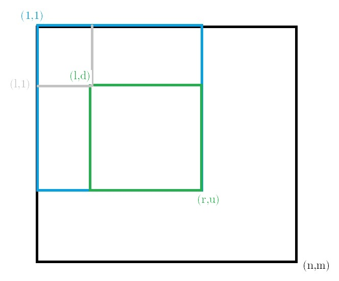

---
tags:
  - 基础算法
  - 前缀和
---

设我们有一个一维数组 $\{a_n\}$。

考虑一个问题：给定一个区间 $[l, r]$，求 $\sum_{i=l}^r a_i$。

我们可以先使用暴力的方法，对于每个询问，遍历 $[l, r]$，时间复杂度 $O(nq)$：

```cpp
int query (int l, int r) {
    int sum = 0;
    for (int i = l; i <= r; i++)
        sum += a[i];
    return sum;
}
```

我们可以发现，$\sum_{i=l}^r a_i = \sum_{i=1}^{r}a_i-\sum_{i=1}^{l-1}a_i$，所以我们可以在 $O(n)$ 时间内预计算 $\{s_n\}=\sum_{i=1}^{n}a_i$：

```cpp
for (int i = 1; i <= n; i++)
    s[i] = s[i-1] + a[i];
```

这样，对于每个询问，我们只需要 $O(1)$ 的时间复杂度：

```cpp
printf("%d\n", s[r] - s[l-1]);
```

我们不难发现，这种预处理的方法，是一个集合的补集，于是就可以推广到二维上。

设我们有一个二维数组 $\{a_{ij}\}$。

考虑一个问题：给定一个矩形区域 $[l, r]\times[d, u]$，求 $\sum_{i=l}^r\sum_{j=d}^u a_{ij}$。

那么设 $s_{l,r,d,u}$ 表示 $\sum_{i=l}^r\sum_{j=d}^u a_{ij}$。

演示图如下：



故

$$
s_{l,r,d,u} = s_{1,1,r,u} - s_{1,1,l-1,u} - s_{1,1,r,u-1} + s_{1,1,l-1,d-1}
$$

注意到 $s_{l,r,d,u}$ 的值只与 $s_{1,1,*,*}$ 的值相关，所以我们可以只计算 ${s_{1,1,d,u}}$ 的值即可，这样就可以优化到 $O(n^2)$。

容易推得 $s_{1,1,d,u} = s_{1,1,d-1,u} + s_{1,1,d,u-1} - s_{1,1,d-1,u-1} + a_{d,u}$。

于是就可以省去前两维，得到 $s_{d,u} = s_{d-1,u} + s_{d,u-1} - s_{d-1,u-1} + a_{d,u}$。

我们可以在 $O(n^2)$ 的时间内预处理出 $\{s_{d,u}\}$：

```cpp
for (int i = 1; i <= n; i++)
    for (int j = 1; j <= m; j++)
        s[i][j] = s[i-1][j] + s[i][j-1] - s[i-1][j-1] + a[i][j];
```

问询的时候便是：

```cpp
int query (int l, int r, int d, int u) {
    return s[r][u] - s[l-1][u] - s[r][d-1] + s[l-1][d-1];
}
printf("%d\n", query(l, r, d, u));
```